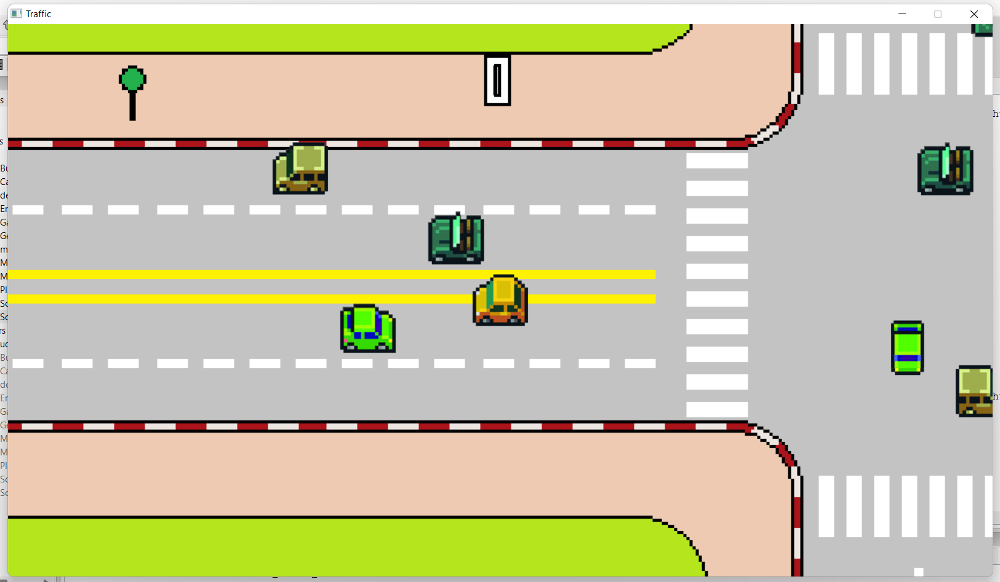
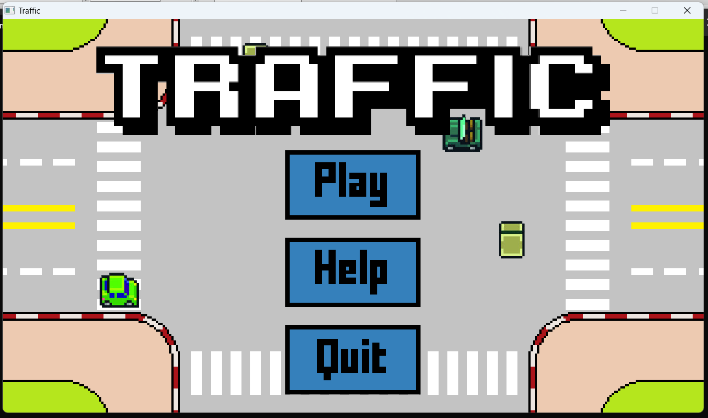
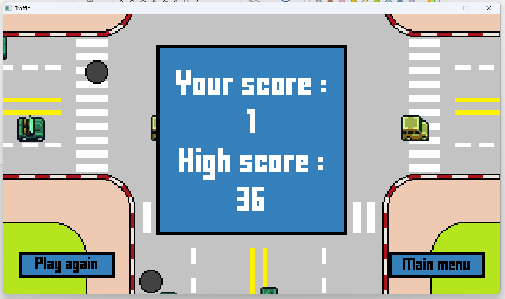

  

# Traffic
A game's made by a lovely guy from UET
## Description
After a hard working day, you are so excited to go home as soon as possible. But you suddenly remembering its five oclock and at this time the road lead to your home, "Cau Giay" is pretty ... But you talk to yourself: "I can do it!" and take your bag go straight to your car. And now, you have to face with the dizzying traffic in the town. Can you get to your home ? Let go and see it !
## Rule
- Your car is the yellow car and you need to avoid other car 
- Any accident will make you lose
- Find the right way to go home by finding the green light
## Instruction
- Moving by press A, W, D, S or arrow keys.
- Yellow light show the previous crossroad we have passed
- Green light show the only way we can pass through
- Red light show the forbidden road and you cant pass through it
- Avoid the holes and the cars across the crossroad
- There are some nice presents across the journey! Just noice a bit and you will find something really interesting!
## Feature
- Everytime we pass through the green light the level will increase (pass a crossroad)
- After some level speed and number of every car will increase
- Speed of other cars always equal to speed of player car
- There are some bonus gift across the journey!
  - Eating the coin will increase the score
  - Eating the blue candy will help you find out the road have the green light faster
  - Eating the rainbow candy will make you invincible! but it only lasts for a certain time so use it effectively!
## Some image about the game

  
  
  

## Credit
- https://www.fontspace.com/flappy-bird-font-f21349 for a beautiful font 
- https://pixabay.com/ for some crazy sound effects
- https://www.youtube.com/watch?v=yLX4ljnnQoY for a chilling soundtrack
- Google for some beautiful car images
- Lazyfoo for the instruction to make a 2D game. You can also learn it by click on this link https://lazyfoo.net/tutorials/SDL/index.php
- And thank to this following people: 
  - Vu Tung Lam, Nguyen Huu Phuong for helping me fixing the code
  - Bao Lam, Tran Duy Nguyen, Tran Gia Bao for testing the game
  - Nguyen Thi Xuan Thanh for the visual issue
- And me, the one who make this game.
## Contact
If you have any idea or find any issue about my game. Please contact me!
- fb: https://www.facebook.com/hoangvanphi2004
- email: hoangvanphi2004@gmail.com

  <h1> --- Thanks for visiting my game --- </h1>
 

